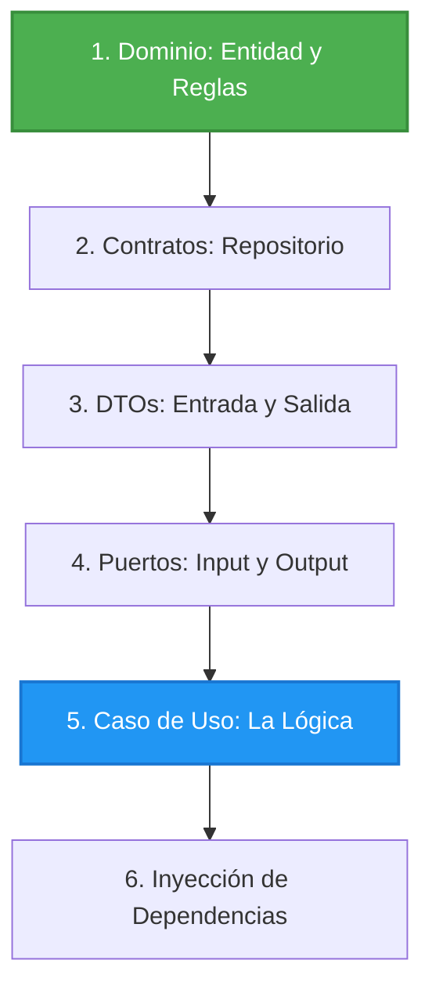

# Capítulo 5: El Orden de Desarrollo (La Receta)

Entender cómo funciona la arquitectura ya lo tienes. Pero cuando el profesor dice *"Para la próxima clase hagan el Caso de Uso de Borrar Cliente"*... **¿Por cuál de las 15 carpetas empiezas a escribir código?**

Aquí tienes la receta visual y paso a paso. Siempre se empieza desde el centro (Dominio) hacia afuera (Aplicación).

---

## 🗺️ Mapa Visual del Desarrollo



---

## 📝 El Paso a Paso Detallado

### Paso 1: El Dominio (Las Reglas)
*¿Este caso de uso requiere reglas nuevas?*
- Si es crear o actualizar, ve a `Customer.cs` y asegúrate de que exista el método (ej. `public static Customer Create(...)` o `public void Update(...)`).
- Si requieres un dato nuevo (ej. `CBU`), crea el Value Object primero.
- Si es un "Borrar Cliente", probablemente no toques el dominio porque simplemente lo eliminas, a menos que sea un "Borrado Lógico" (`customer.Desactivar()`).

### Paso 2: El Repositorio (El Contrato de BD)
*¿Qué le vas a pedir a la base de datos?*
Ve a `1. Domain/Customers/Repositories/ICustomerRepository.cs`.
Agrega la firma de lo que vas a necesitar. Por ejemplo:
```csharp
Task DeleteAsync(Guid id); // Agregas esto si vas a borrar
```

### Paso 3: Los DTOs (Las Cajas de Cartón)
*¿Qué datos te mandará el usuario y qué le vas a responder?*
Ve a `2. Application/Customers/DTOs/` y crea dos records:
```csharp
public record DeleteCustomerRequest(Guid CustomerId);
public record DeleteCustomerResponse(Guid CustomerId, string Mensaje);
```

### Paso 4: Los Puertos (Los Intercomunicadores)
*¿Cómo se va a comunicar tu caso de uso con el exterior?*
Ve a `2. Application/Customers/Ports/` y crea las dos interfaces:
1. **Input Port** (`IDeleteCustomerInputPort.cs`):
   ```csharp
   public interface IDeleteCustomerInputPort {
       Task ExecuteAsync(DeleteCustomerRequest request);
   }
   ```
2. **Output Port** (`IDeleteCustomerOutputPort.cs`): Piensa en los caminos posibles.
   ```csharp
   public interface IDeleteCustomerOutputPort {
       Task HandleSuccessAsync(DeleteCustomerResponse response);
       Task HandleNotFoundAsync(Guid customerId); // Si quieres borrar algo que no existe
   }
   ```

### Paso 5: El Caso de Uso (Unir las piezas)
*El Director de Orquesta.*
Ve a `2. Application/Customers/UseCases/` y crea `DeleteCustomerUseCase.cs`.
- Haz que herede de tu Input Port (`: IDeleteCustomerInputPort`).
- Pídele al constructor el Repositorio y el Output Port.
- Escribe la lógica del método `ExecuteAsync`:
  1. Busca al cliente (`FindByIdAsync`).
  2. Si es null -> `_outputPort.HandleNotFoundAsync(...)`.
  3. Si existe -> `_repository.DeleteAsync(...)`.
  4. Avisa el éxito -> `_outputPort.HandleSuccessAsync(...)`.

### Paso 6: Conectar los Cables (Dependency Container)
Ve a `2. Application/DependencyContainer.cs` y avísale al sistema que este nuevo caso de uso existe.
```csharp
services.AddScoped<IDeleteCustomerInputPort, DeleteCustomerUseCase>();
```

---

### 💡 Resumen Mental:
**D**ominio ➡️ **R**epositorio ➡️ **D**TOs ➡️ **P**uertos ➡️ **C**aso de Uso.
¡Si sigues este orden, nunca te faltará una clase a la hora de escribir el código principal del Caso de Uso!
