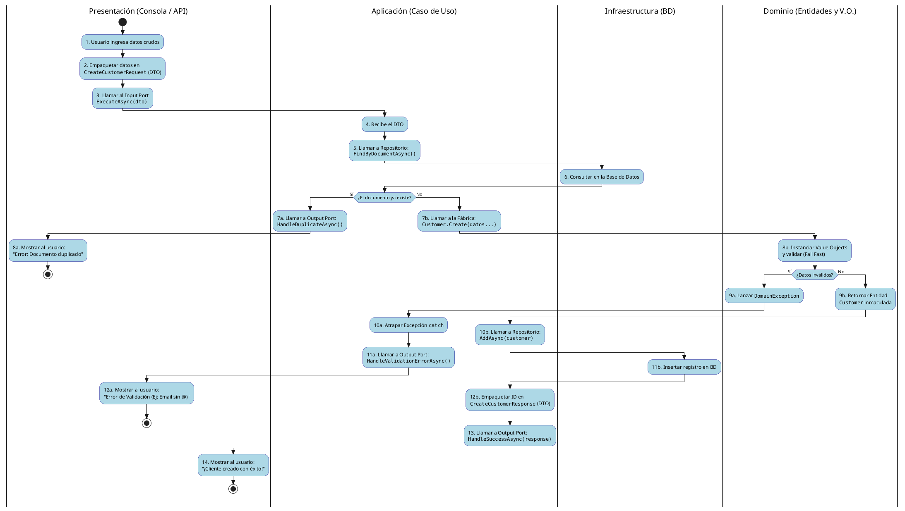

# Diagrama de Flujo: Create Customer Use Case a través de las Capas

Este documento explica de forma visual y textual cómo la información viaja saltando entre las distintas capas (Presentación, Aplicación, Dominio e Infraestructura) durante el proceso de registrar un nuevo cliente.

## Explicación de la Danza entre Capas

1. **Capa Externa (Presentación/Consola):** El usuario escribe sus datos. La consola los agrupa en un "paquete" (Input DTO) que no tiene lógica. Se llama al "botón de inicio" del Caso de Uso (el Input Port).
2. **Capa de Aplicación (Caso de Uso):** Recibe el paquete. Su primera tarea es orquestar: le pide a la capa de Infraestructura que revise si el documento ya existe en la Base de Datos.
3. **Capa de Infraestructura (Repositorio):** Va a la base de datos y responde.
4. **Capa de Aplicación:** Si ya existe, usa un "intercomunicador" (Output Port) para decirle a la Presentación que aborte la misión y muestre un error. Si no existe, llama a la Capa de Dominio pasándole los datos crudos.
5. **Capa de Dominio (Entities/Value Objects):** Evalúa los datos con lupa. Si un Value Object detecta que el email no tiene arroba, explota (Fail Fast) lanzando un `DomainException`.
6. **Capa de Aplicación:** Si explotó, la atrapa y le dice a la Presentación (vía Output Port) que muestre un error de formato. Si todo salió bien en el Dominio, el Dominio devuelve un Objeto Cliente puro y válido.
7. **Capa de Aplicación:** Agarra ese Objeto Cliente válido y se lo entrega a Infraestructura para que lo guarde.
8. **Capa de Infraestructura:** Guarda los datos en la BD.
9. **Capa de Aplicación:** Genera un nuevo "paquete de respuesta" (Output DTO) para no revelar el Cliente entero, y le avisa a Presentación (vía Output Port) que todo salió bien.
10. **Capa Externa:** Muestra los fuegos artificiales de éxito al usuario.

---

## Código PlantUML (Diagrama de Actividad)

Puedes copiar y pegar este bloque de código en cualquier visor de PlantUML (como [PlantText](https://www.planttext.com/) o una extensión de VSCode) para generar un diagrama visual con "carriles" (swimlanes) que demuestran qué capa hace qué en cada momento.

