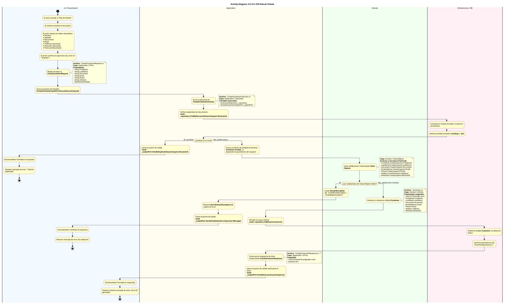

# Diagrama de Actividades: CU-CLI-001 (Alta de Cliente)

Este documento contiene el modelo en **PlantUML** del flujo de actividades para el caso de uso **CLI-001 (Alta de Cliente)**, detallando paso a paso la interacción entre las distintas capas de la **Clean Architecture** implementada en el proyecto `CommerX`.

Se incluyen los nombres de archivos involucrados, variables, propiedades, métodos y manejo de excepciones.

## Código PlantUML

Puedes copiar y pegar el siguiente bloque de código en cualquier visor de PlantUML o instalar la extensión correspondiente en tu IDE.

## Resumen del Flujo por Capas

1. **UI / Presentación:** Responsable de capturar los datos del usuario, armar el DTO de solicitud (`CreateCustomerRequest`) y enviarlo al puerto de entrada (`ICreateCustomerInputPort`). También maneja los resultados del caso de uso a través del Output Port.
2. **Application (Aplicación):** Contiene el núcleo de orquestación (`CreateCustomerUseCase`). Llama al repositorio (abstracción) para comprobar si hay duplicados, luego llama al dominio para construir el modelo y, de no haber excepciones, ordena la persistencia y emite la respuesta (`CreateCustomerResponse`) mediante el Output Port.
3. **Domain (Dominio):** Centraliza la creación de los *Value Objects* (`FirstName`, `LastName`, `EmailAddress`, etc.), aplicando validaciones exhaustivas (Fail Fast). Si hay datos inválidos, arroja excepciones (`DomainException`). Si todo es correcto, crea la entidad `Customer` protegida por su Factory Method estático.
4. **Infrastructure / DB:** Es la implementación real del contrato `ICustomerRepository`, encargada de ir a la base de datos a revisar registros duplicados (`FindByDocumentAsync`) o guardar un nuevo registro (`AddAsync`).
