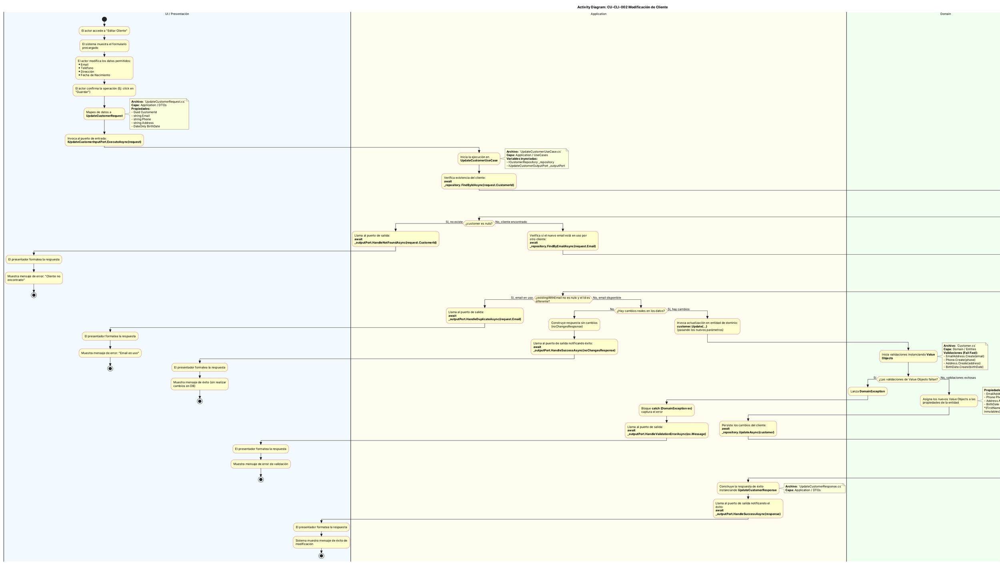

# Diagrama de Actividades: CU-CLI-002 (Modificación de Cliente)

Este documento contiene el modelo en **PlantUML** del flujo de actividades para el caso de uso **CLI-002 (Modificación de Cliente)**, detallando paso a paso la interacción entre las distintas capas de la **Clean Architecture** implementada en el proyecto `CommerX`.

Se incluyen los nombres de archivos involucrados, variables, propiedades, métodos y manejo de excepciones.

## Código PlantUML

Puedes copiar y pegar el siguiente bloque de código en cualquier visor de PlantUML o instalar la extensión correspondiente en tu IDE.

## Resumen del Flujo por Capas

1. **UI / Presentación:** Captura los datos del usuario a modificar, arma el DTO de solicitud (`UpdateCustomerRequest`) y lo envía al puerto de entrada (`IUpdateCustomerInputPort`). Recibe las respuestas del Output Port para mostrar el resultado al usuario.
2. **Application (Aplicación):** Contiene el núcleo de orquestación (`UpdateCustomerUseCase`). 
   - Llama al repositorio para validar la existencia del cliente (`FindByIdAsync`) y evitar duplicidad de emails (`FindByEmailAsync`).
   - Verifica si hubo cambios reales en los datos antes de proceder.
   - Llama a la entidad de dominio (`customer.Update()`) para aplicar los cambios y, si es exitoso, persiste los datos a través del repositorio (`UpdateAsync`) antes de devolver la respuesta (`UpdateCustomerResponse`).
3. **Domain (Dominio):** Realiza la validación a través de la creación de los *Value Objects* en el método `Update` de la entidad `Customer`. Si hay datos inválidos, lanza excepciones (`DomainException`). Solo si todo es correcto, asigna los nuevos *Value Objects* a las propiedades, respetando la inmutabilidad de la identidad del cliente (Nombre, Apellido, Documento).
4. **Infrastructure / DB:** Implementa el contrato `ICustomerRepository`, interactuando con la base de datos para buscar registros (`FindByIdAsync`, `FindByEmailAsync`) y actualizar un registro existente (`UpdateAsync`).
