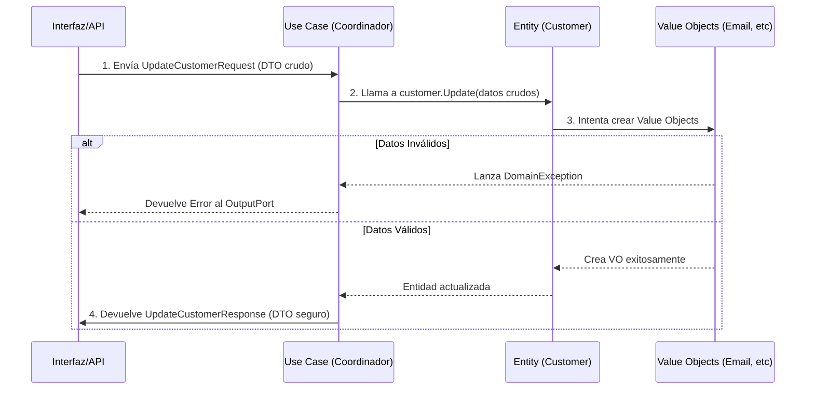

# Repaso de Clean Architecture - CommerX

## 1. El viaje del dato (De DTO a Dominio)

**Cómo viaja la información cruda hasta convertirse en algo seguro y procesado:**

1.  **Entrada (DTO):** Los datos llegan crudos y sin validar desde el exterior a través del `UpdateCustomerRequest` (strings, ints, etc.).
2.  **Validación y Reglas (Entity / Value Object):** El Caso de Uso toma esos datos y se los pasa a la Entidad `Customer` (mediante `customer.Update()`). Aquí, los *Value Objects* intentan instanciarse con esos datos crudos. Si el dato es inválido (ej. email sin '@'), el Value Object lanza una `DomainException`. Si es válido, la Entidad actualiza su estado.
3.  **Salida (DTO):** Si todo fue exitoso, el Caso de Uso toma los datos ya seguros de la Entidad (ej. `customer.Email.Value`) y los empaqueta en un `UpdateCustomerResponse` para devolverlos al exterior.

### Diagrama de Secuencia (Mermaid)
Copia este código en tu diagramador (ej. draw.io, Mermaid Live):



---

## 2. Quién hace qué (Responsabilidades)

Aquí tienes la separación de responsabilidades de cada archivo involucrado en el proceso, usando tus excelentes analogías:

*   **DTO (Request/Response):** *La valija tonta.* Solo transporta datos primitivos de un lado a otro. No tiene lógica ni valida absolutamente nada.
*   **Value Object (Email, Phone, etc.):** *El patovica del dato puntual.* Protege que un dato específico tenga sentido y sea válido (ej: que el Email tenga '@'). Si no le gusta, no te deja pasar (lanza excepción).
*   **Entity (Customer):** *El dueño de las reglas del negocio.* Decide qué se puede hacer y qué no a nivel de la entidad completa. Agrupa a los Value Objects y controla el estado (ej: actualizar los datos).
*   **Use Case / Service:** *El recepcionista / coordinador.* Recibe la valija (DTO), busca en la base de datos, le pide a la Entidad que aplique los cambios (que use a sus patovicas) y finalmente le pasa la entidad actualizada a la interfaz de base de datos para que la guarde. No tiene reglas de negocio propias.
*   **IRepository:** *La promesa de guardado.* Es un contrato que asegura que alguien, en otra capa (Infraestructura), se encargará de guardar la entidad validada en la base de datos real.

---

## 3. Diagrama simple de tubería

Un diagrama de flujo lineal y claro para entender cómo fluyen los datos y el control.

### Diagrama de Flujo (Mermaid)
Copia este código en tu diagramador:

```mermaid
flowchart LR
    A[1. Datos Crudos\n(DTO)] --> B[2. Coordinador\n(Caso de Uso)]
    B --> C[3. Validación y Reglas\n(Entity + Value Objects)]
    C --> D[4. Interfaz de Salida\n(IRepository)]
    
    style A fill:#f9f,stroke:#333,stroke-width:2px
    style B fill:#bbf,stroke:#333,stroke-width:2px
    style C fill:#bfb,stroke:#333,stroke-width:2px
    style D fill:#fbb,stroke:#333,stroke-width:2px
```
