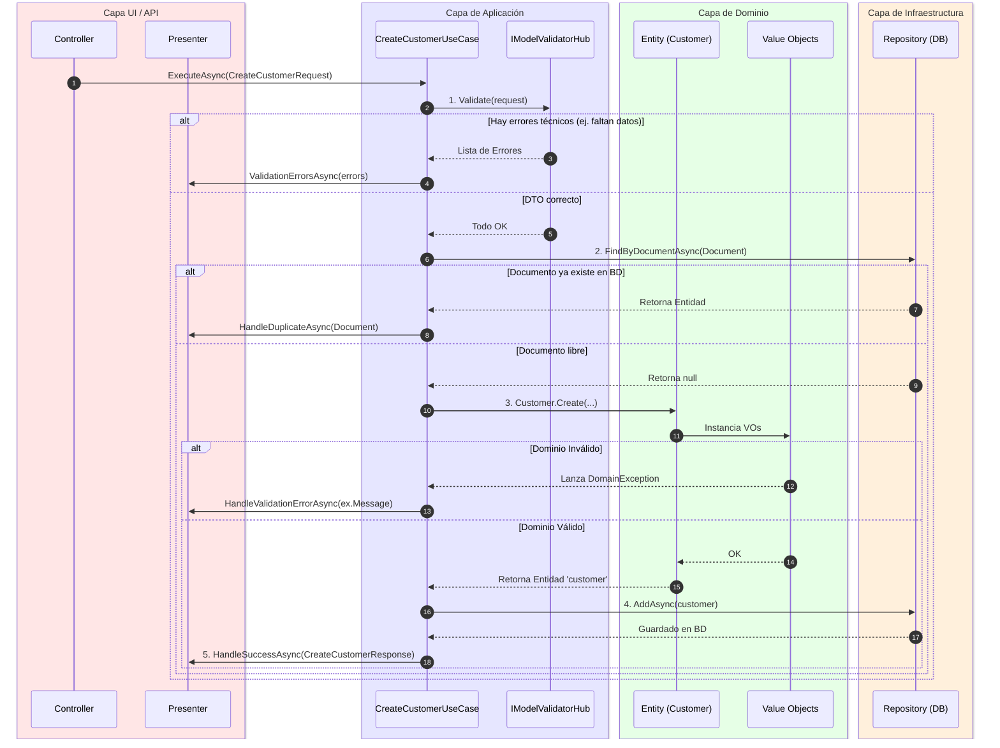
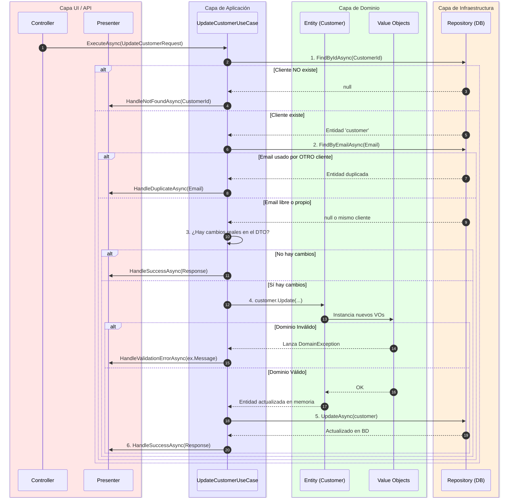

# Flujo Detallado de Arquitectura - CommerX

Este documento detalla el ciclo de vida completo de las peticiones, capa por capa, archivo por archivo y función por función. Hemos incluido el flujo exacto para los dos Casos de Uso principales.

---

## 1. El Mapa de Capas (Regla de Dependencia)

Antes de ver el flujo, recordemos cómo se comunican las capas. **La regla de oro: Las dependencias siempre apuntan hacia adentro (hacia el Dominio).**

```mermaid
graph TD
    subgraph Capa Externa (UI / API)
        C[Controllers / Console]
        P[Presenters]
    end

    subgraph Capa Externa (Infraestructura)
        R[Repositorios SQL/Mongo]
    end

    subgraph Capa Intermedia (Application)
        UC[Use Cases]
        IP[Input Ports]
        OP[Output Ports]
        DTO[DTOs]
    end

    subgraph Capa Central (Domain)
        EN[Entities]
        VO[Value Objects]
        IR[Interfaces de Repositorio]
    end

    %% Relaciones
    C -. "Llama a" .-> IP
    P -. "Implementa" .-> OP
    R -. "Implementa" .-> IR
    
    UC -- "Implementa" --> IP
    UC -- "Usa" --> OP
    UC -- "Usa" --> IR
    UC -- "Usa" --> EN
    EN -- "Contiene" --> VO
    
    style EN fill:#bfb,stroke:#333
    style VO fill:#bfb,stroke:#333
    style IR fill:#bfb,stroke:#333
    style UC fill:#bbf,stroke:#333
    style C fill:#f9f,stroke:#333
    style R fill:#fbb,stroke:#333
```

---

## 2. Flujo Completo: CreateCustomerUseCase (Alta de Cliente)

Este flujo es interesante porque **incluye un paso extra de validación inicial (`IModelValidatorHub`)** antes de llegar al dominio.

### Diagrama de Secuencia y Capas



### Detalle Archivo por Archivo (CreateCustomerUseCase)
*   **Origen (UI):** Alguien (un Controller o Consola) crea un `CreateCustomerRequest` (DTO) y llama al método `ExecuteAsync` del Caso de Uso.
*   **Archivo: `CreateCustomerUseCase.cs` | Función: `ExecuteAsync()`**
    *   **Línea 37:** Llama a `_validator.Validate(request)`. Esto revisa que los datos no estén nulos o vacíos antes de molestar al Dominio.
    *   **Línea 48:** Llama a la interfaz `ICustomerRepository.FindByDocumentAsync`. Sale de Aplicación hacia Infraestructura (BD) para ver si el DNI ya existe.
    *   **Línea 58:** Llama a `Customer.Create(...)`. **¡Entramos al Dominio!** Aquí se instancian los Value Objects. Si falla, el `catch (DomainException)` (Línea 80) intercepta el error.
    *   **Línea 69:** Llama a `ICustomerRepository.AddAsync(customer)`. Envía la entidad limpia y validada a la BD para guardarla.
    *   **Línea 78:** Llama a `_outputPort.HandleSuccessAsync(...)`. Sale de Aplicación hacia UI para decirle al Presenter "¡Todo salió bien, avísale al usuario!".

---

## 3. Flujo Completo: UpdateCustomerUseCase (Edición de Cliente)

El flujo de actualización es ligeramente distinto: **busca primero, compara después, y actualiza al final.**

### Diagrama de Secuencia y Capas



### Detalle Archivo por Archivo (UpdateCustomerUseCase)
*   **Origen (UI):** Se recibe un `UpdateCustomerRequest` con el ID del cliente y los nuevos datos.
*   **Archivo: `UpdateCustomerUseCase.cs` | Función: `ExecuteAsync()`**
    *   **Línea 49:** `_repository.FindByIdAsync(...)`. Va a la BD a traer el cliente original.
    *   **Línea 66:** `_repository.FindByEmailAsync(...)`. Va a la BD para asegurar que el nuevo Email no se lo estemos robando a otro usuario.
    *   **Línea 84:** Se comparan los valores: `customer.Email.Value == request.Email`. Si no cambió nada, aborta temprano y simula éxito (Línea 102).
    *   **Línea 111:** Llama a `customer.Update(...)`. **Entra al Dominio**. Revalida todo creando nuevos Value Objects y reemplazando los viejos.
    *   **Línea 121:** Llama a `_repository.UpdateAsync(...)`. Impacta los cambios finales en la Base de Datos.
    *   **Línea 138:** Llama a `_outputPort.HandleSuccessAsync(...)`. Notifica a la interfaz que los datos se guardaron correctamente.
